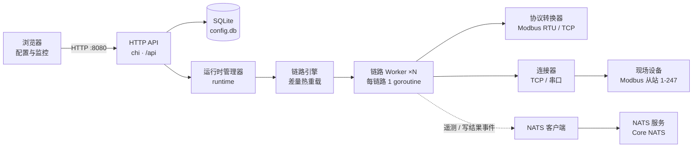

# PowerPulse Gateway

IoT 数据采集网关 —— 单一 Go 二进制，内嵌 Web 配置界面与 SQLite 数据库。通过串口（RS-485）或以太网以 **Modbus RTU / TCP** 协议轮询现场设备，提供实时数据、报文监控、写值下发，并可作为 Core NATS 客户端把遥测数据扇出到北向平台、接收远程控制命令。

浏览器访问即可完成全部配置与监控。网关作为一个独立微服务运行，目标部署环境为嵌入式 **aarch64 / Ubuntu**，也可在 Windows / Linux / macOS 上开发运行。

> 📐 交互式架构图：[docs/architecture.html](docs/architecture.html)（可搜索、聚焦、切换明暗主题、导出 PNG/SVG）

---

## 目录

- [系统架构](#系统架构)
- [功能特性](#功能特性)
- [快速开始](#快速开始)
- [工作原理](#工作原理)
- [NATS 北向接口](#nats-北向接口)
- [REST API](#rest-api)
- [配置参考](#配置参考)
- [目录结构](#目录结构)
- [开发与测试](#开发与测试)
- [生产部署（systemd）](#生产部署systemd)
- [常见问题](#常见问题)
- [已知限制](#已知限制)
- [文档索引](#文档索引)

---

## 系统架构



分层职责：

| 层 | 包 | 职责 |
|----|----|------|
| Web / API | `internal/web`、`internal/api` | chi 路由、REST 处理器、内嵌静态前端 |
| 运行时 | `internal/runtime` | 采集运行时组合根：组装 engine、NATS 客户端与 PlanSource；进程内重启不退出 HTTP 服务 |
| 编排 | `internal/engine` | 链路 supervisor（差量热重载）、worker 采集循环、实时值缓存、通讯监控 |
| 协议 | `internal/engine/converter` | Modbus 组帧 / 解帧、CRC / MBAP 校验、异常码解析、工程值映射、寄存器分组 |
| 传输 | `internal/engine/connector` | `Driver` 接口屏蔽串口 / TCP 差异 |
| 北向 | `internal/natsclient` | 遥测发布、命令订阅、拓扑查询 |
| 基础设施 | `internal/store`、`internal/logx`、`internal/config` | GORM + SQLite、三路日志输出、设置持久化 |

## 功能特性

- **单文件部署**：纯 Go（无 CGO），前端经 `embed.FS` 编译进二进制，目标设备零依赖运行。
- **设备模型驱动的采集**：属性定义功能码、寄存器基址 / 偏移、位段、字节序、系数与偏移量，引擎自动完成寄存器分组合并读请求。
- **Modbus RTU / TCP**：读功能码 01 / 02 / 03 / 04；写功能码 05（单线圈）/ 06（单寄存器）/ 16（多寄存器）；异常码解析、渐进式帧累积（RTU 定长、TCP 按 MBAP 长度）。
- **链路热重载**：配置保存即生效；以配置指纹差量启停 worker，未变化的链路保持原连接不重启。
- **弹性链路**：每条链路独立 goroutine；连接失败固定每 3 秒重连（可设上限）；单帧可配重发次数与帧间隔；半双工总线帧间隔可调。
- **实时数据与写值**：采集值缓存为会话快照供 API 查询；写命令进入 worker 优先队列（容量 32），工程值自动逆变换后编码下发。
- **通讯监控**：每链路 500 条 TX / RX / ERR 报文环形缓冲（hex 展示），会话级请求 / 成功 / 失败 / 错误率统计，`afterSeq` 增量拉取。
- **在线状态**：模型内置虚拟属性「在线状态」，报文交互正常为 1，链路断开或设备无响应为 0，随遥测一并发布。
- **三路日志**：终端（文本）+ 滚动文件（JSON，大小 / 每日轮转、压缩、保留份数）+ 前端 SSE 实时流。
- **NATS 北向出口**：遥测快照与写命令结果发布到 `data` 主题；订阅 `cmd` / `query` 支持远程写值与拓扑查询；失败自动降级不影响本地采集。
- **防误配**：同一串口端口、同一 IP:Port 不允许被多条链路占用；模型保存时校验协议（仅 Modbus RTU / TCP）与接口类型（仅串口 / 网络）白名单。

## 快速开始

### 环境要求

| 项 | 要求 |
|----|------|
| Go | **1.23+**（`go.mod` 指定 `go 1.23`） |
| CGO | 不需要（SQLite 为纯 Go 驱动 `glebarez/sqlite`） |
| 运行时依赖 | 无；数据库、日志目录自动创建 |
| 浏览器 | 现代浏览器（访问配置界面） |

### 构建与运行

```bash
git clone <仓库地址> Gateway
cd Gateway
go mod download

# 本机运行（开发）
go run . -addr :8080

# 交叉编译 aarch64 / Ubuntu（部署目标）
GOOS=linux GOARCH=arm64 CGO_ENABLED=0 \
  go build -trimpath -ldflags="-s -w -X gateway/internal/buildinfo.Version=v1.0.0" \
  -o gateway_arm64 .
```

Windows PowerShell 交叉编译：

```powershell
$env:GOOS="linux"; $env:GOARCH="arm64"; $env:CGO_ENABLED="0"
go build -trimpath -ldflags="-s -w -X gateway/internal/buildinfo.Version=v1.0.0" -o gateway_arm64 .
Remove-Item Env:\GOOS, Env:\GOARCH, Env:\CGO_ENABLED
```

`-X gateway/internal/buildinfo.Version` 注入版本号（软件信息卡展示），未注入时显示 `dev`；`-trimpath -s -w` 去除路径与符号、缩小体积。

### 启动与访问

```bash
./gateway_arm64 -addr :8080 -db data/config.db
```

启动日志输出 `网关微服务启动 addr=:8080 url=http://localhost:8080`，浏览器打开 `http://<设备IP>:8080` 进入配置界面，覆盖 **设备模型 / 链路通道 / 实时数据 / 报文信息** 四大模块与网关设置。

`Ctrl+C` 触发优雅关闭（10 秒内处理完在途请求后退出），再次 `Ctrl+C` 强制退出。

## 工作原理

### 1. 设备模型与链路通道

- **设备模型（DeviceModel）** = 档案（`profile`）+ 属性数组（`properties`），整体以 JSON 存 SQLite。属性字段：

| 字段 | 说明 |
|------|------|
| `name` / `id` | 属性名 / 属性 ID（遥测发布按 ID 索引） |
| `dataType` | `bool` / `int` / `float` / `string` |
| `registerBase` / `registerOffset` | 寄存器基址 / 相对偏移，实际地址 = 基址 + 偏移 |
| `startBit` / `endBit` | 位段提取（bit 0 = 最低位），须落在 `registerCount × 16` 位宽度内 |
| `registerCount` | 寄存器数量（读取跨度），必填 1~125，缺失时构建采集计划报错 |
| `readFunctionCode` | 01 / 02 / 03 / 04 |
| `writeFunctionCode` | 05 / 06 / 16 |
| `coefficient` / `deltaValue` | 工程值 = 原始值 × coefficient + deltaValue（写值时逆变换） |
| `byteOrder` | `ABCD` / `CDAB` / `BADC` / `DCBA`（16 位为 `AB` / `BA`） |
| `accessMode` | `r` / `w` / `rw` |

示例见 [docs/device-model.example.json](docs/device-model.example.json)。

- **链路通道（Channel）** = 通道索引（从 0 开始自动分配、不可修改）+ 通道ID（规则 `Channel-{通道索引}`，自动生成不可修改）+ 类型（`Serial` / `Network`，CAN 已移除）+ 通信参数 + 挂载设备列表（`[{index, commNo, modelId}]`，`commNo` 为 Modbus 从站地址 1-247）。示例见 [docs/channel.example.json](docs/channel.example.json)。

### 2. 采集计划与寄存器分组

启动或配置变更时，`BuildPlans` 把链路 + 模型编译为采集计划：属性按 `(readFC, registerBase)` 分桶，一次读请求覆盖同桶最远地址（默认单请求不超过 125 寄存器，模型可用 `maxRegisterCount` 收紧）；响应帧按 `registerOffset × 2` 切片定位各属性，再经位段提取与字节序重排得到工程值。

### 3. Worker 采集循环

- 连接失败每 3 秒重连；`reconnectRetries > 0` 时达到上限后放弃链路并持续发布离线遥测。
- 轮询：一个 tick 轮询一个设备（默认 500ms，`pollInterval` 可配）；**写命令优先**——每次循环先清空写队列再继续轮询。
- 帧读取：渐进式累积字节（不足返回 `ErrShortFrame` 继续 read），单次接收超时 1.5s、整帧上限 3s；链路层错误（EOF / 连接重置）直接触发重连，超时类错误按重发策略处理。

### 4. 热重载与配置指纹

模型 / 链路的每次保存、删除都会触发 `ConfigChanged`：运行时从 `PlanSource` 拉取全量配置、重建采集计划后交给引擎差量调谐——新增启动、删除停止、指纹变化先停后启。指纹覆盖链路类型、传输参数、轮询间隔及全部属性元数据（浮点按 IEEE 754 二进制精确匹配），指纹未变的链路不受影响。

### 5. 通讯监控

每条链路维护 500 条报文环形缓冲（TX / RX 为 hex 帧，ERR 为最终失败原因）与会话计数器；重连后开启新会话，序号跨会话单调递增，前端用 `afterSeq` 增量拉取不会把重连误判为旧数据。

### 6. 模块边界

网关以单一微服务形态交付、不再进一步拆分；内部按配置面 / 采集面收敛边界，使各模块可独立测试、实现可替换：

- **`engine.PlanSource`**（`internal/engine/source.go`）：引擎读取配置的唯一入口，进程内由 `runtime.dbPlanSource` 从 SQLite 加载并转换为引擎 DTO；如需接入远程配置中心，仅需替换该实现，引擎与 worker 代码不变。
- **`engine.EventSink`**：北向事件出口（遥测 / 写结果），当前由 NATS 客户端实现。
- **`api.RuntimeFacade`**：配置面保存后只调用 `ConfigChanged()` 通知变更，不直接操作引擎。
- **`runtime.Manager`**：采集运行时组合根，负责引擎与北向客户端的生命周期。

## NATS 北向接口

在网关设置中启用 NATS 后，网关作为 Core NATS 客户端接入（完整设计见 [docs/nats-client-design.md](docs/nats-client-design.md)）。

**主题**：`{subjectPrefix}.{gw_id}` 下三个子主题——`.data`（遥测发布）、`.cmd`（命令订阅）、`.query`（查询订阅）。默认前缀 `powerpulse.gateway`，如 `powerpulse.gateway.gw_000.data`。

**消息信封**（NATS Headers）：`PP-Message-ID` / `PP-Message-Type` / `PP-Message-Version`（`v1.0`）/ `PP-Message-Timestamp`（毫秒），payload 为 JSON。

| 类型 | 方向 | payload 要点 |
|------|------|--------------|
| `data` | 网关 → 平台 | `channel_index`、`device_index`、`comm_no`、`model_id`、`properties: {id: {name, value, timestamp}}`，每轮采集一帧完整快照（离线时仅含在线状态 = 0） |
| `cmd` | 平台 → 网关 | `channel_index`、`device_index`、`name`（属性名）、`value`（工程值）；网关立即回 `cmdAck`（`status: accepted`） |
| `cmdAck` | 网关 → 平台 | `request_id`（对应消息 ID）、`status`（`accepted` / `success` / `failure`）、`message`；写命令最终结果随后以 `data` 主题的 `cmdAck` 类型再发布一次 |
| `query` | 平台 → 网关 | `type: "queryTopology"` 返回全量链路 / 设备 / 属性清单（`queryResp`） |

**降级策略**：启动时连接、订阅或初始化失败仅记录警告，网关继续运行（本地采集与 Web 配置不受影响），但不再发布北向数据、不接收命令与查询；NATS 服务恢复后通过 `POST /api/restart` 或重启进程重新初始化。运行期断线由 nats.go 自动重连缓冲。

## REST API

前缀 `/api`，响应统一为 `{"code": 0, "data": ...}` 或 `{"code": <http状态>, "msg": "..."}`。

| 方法 | 路径 | 说明 |
|------|------|------|
| GET | `/api/models` | 设备模型列表 |
| POST | `/api/models` | 新建 / 更新模型（按 ID upsert） |
| DELETE | `/api/models/{id}` | 删除模型 |
| GET | `/api/channels` | 链路列表（按通道索引升序） |
| POST | `/api/channels` | 新建 / 更新链路（含串口 / IP:Port 冲突检测；通道索引与通道ID 服务端生成、不可修改） |
| DELETE | `/api/channels/{id}` | 删除链路（`id` 为字符串通道ID，如 `Channel-0`） |
| GET | `/api/realtime?device={channelIndex}/{deviceIndex}` | 该设备的全部缓存实时值（通道索引从 0 开始） |
| POST | `/api/set` | 下发写值：`{channelIndex, deviceIndex, propName, value}` |
| GET | `/api/comm-monitor?channelIndex=&deviceIndex=&afterSeq=&limit=` | 通讯报文 + 会话统计（`limit` ≤ 1000） |
| GET | `/api/hardware` | 硬件接口映射（丝印 → 设备节点） |
| GET / POST | `/api/settings` | 读取 / 保存网关设置 |
| GET | `/api/system-info` | 操作系统、系统时间、Gateway 版本 |
| POST | `/api/restart` | 进程内重启运行时（引擎 + NATS） |
| GET | `/api/engine/status` | 各链路运行状态快照（连接 / 目标 / 最近错误） |
| GET | `/api/syslog` | 系统日志快照 |
| GET | `/api/syslog/stream` | 系统日志 SSE 实时推送 |

## 配置参考

### 命令行参数

| 参数 | 默认值 | 说明 |
|------|--------|------|
| `-addr` | `:8080` | HTTP 监听地址 |
| `-db` | `data/config.db` | SQLite 数据库路径（目录自动创建） |

### 网关设置

全部设置保存在 SQLite 的 `gateway_settings` 单记录中（首次启动写入内置默认值，之后以数据库为准），通过 Web 界面「网关设置」修改。静态默认值定义在 `internal/config/config.go`；YAML 配置文件已不再使用。

| 分类 | 字段 | 默认值 | 生效时机 |
|------|------|--------|----------|
| 日志 | `log.level` | `info` | 保存后立即 |
| | `log.console` / `log.file` | `true` / `logs/gateway.log` | 保存后立即 |
| | `log.maxSizeMB` / `maxBackups` / `maxAgeDays` | `20` / `30` / `30` | 保存后立即 |
| | `log.compress` / `log.dailyRotate` | `true` / `true` | 保存后立即 |
| | `log.bufferSize`（SSE 环形缓冲） | `500` | 保存后立即 |
| 网关 | `gateway.gw_id`（用于 NATS 主题，不能含 `.`） | `gw_000` | 重启运行时后 |
| | `gateway.sn`（网关硬件序列号） | 空 | 重启运行时后 |
| | `gateway.location` | 空 | 重启运行时后 |
| NATS | `nats.enabled` | `false` | 重启运行时后 |
| | `nats.url` | `nats://127.0.0.1:4222` | 重启运行时后 |
| | `nats.subjectPrefix` | `powerpulse.gateway` | 重启运行时后 |
| | `nats.queueSize`（发布队列） | `4096` | 重启运行时后 |
| | `nats.connectTimeout` / `reconnectWait` (ms) | `2000` / `2000` | 重启运行时后 |
| | `nats.maxReconnects`（-1 无限） | `-1` | 重启运行时后 |
| | `nats.retryOnFailedConnect` | `true` | 重启运行时后 |
| | `nats.pingInterval` (ms) / `maxPingsOut` | `20000` / `3` | 重启运行时后 |

「重启运行时」可点击软件设置卡的重启按钮（`POST /api/restart`，进程内重建引擎与 NATS 客户端），无需重启进程。

### 硬件接口映射

描述面板丝印与设备节点的对应关系，链路配置时选择丝印、导出 JSON 自动填充真实节点：

```yaml
Serial:        # 串口
  COM1: /dev/ttyS1
  COM2: /dev/ttyS2
```

## 目录结构

```
Gateway/
├── main.go                        # 入口：参数解析、信号处理、优雅关闭
├── internal/
│   ├── api/                       # REST 处理器（model / channel / realtime / comm / settings…）
│   ├── buildinfo/                 # 版本号（构建时 -ldflags 注入）
│   ├── config/                    # 设置默认值、校验与 gateway_settings 持久化
│   ├── engine/
│   │   ├── engine.go              # 链路 supervisor：差量热重载、写命令投递
│   │   ├── worker.go              # 每链路 goroutine：连接 / 轮询 / 写执行 / 在线状态
│   │   ├── plan.go                # ChannelSpec+ModelSpec → 采集计划（分组 / 转换器装配）
│   │   ├── source.go              # ChannelSpec/ModelSpec/PlanSource：配置读取边界
│   │   ├── monitor.go             # 通讯报文环形缓冲与会话统计
│   │   ├── event.go               # EventSink：遥测 / 写结果事件
│   │   ├── connector/             # Driver 接口 + TCP / 串口驱动
│   │   └── converter/
│   │       ├── converter.go       # FrameIO 统一协议接口
│   │       ├── grouping.go        # 寄存器分组策略
│   │       ├── mapper.go          # 字节 ↔ 工程值映射（位段 / 字节序）
│   │       ├── value.go           # 写值 PDU 编码
│   │       └── modbus/            # RTU / TCP 组帧解帧、CRC、异常码
│   ├── runtime/                   # 采集运行时组合根：PlanSource 实现 + engine/NATS 生命周期
│   ├── logx/                      # 终端 + 滚动文件 + SSE 三路日志
│   ├── natsclient/                # Core NATS 客户端（data / cmd / query）
│   ├── store/                     # GORM 模型与 SQLite 连接
│   └── web/                       # chi 路由 + embed 静态前端
├── docs/                          # 设计文档、示例 JSON、架构图
├── data/                          # 运行时生成：config.db
└── logs/                          # 运行时生成：gateway.log 及轮转归档
```

## 开发与测试

```bash
go test ./...
```

现有测试覆盖：connector 配置解析、TCP 基础收发、引擎热重载（指纹差量）、通讯监控序号语义、工程值映射、日志轮转策略、运行时 `ConfigChanged` 热重载管线。协议层后续扩展需同步补充帧解析测试。

## 生产部署（systemd）

`/etc/systemd/system/gateway.service`：

```ini
[Unit]
Description=PowerPulse Gateway
After=network.target

[Service]
Type=simple
WorkingDirectory=/opt/gateway
ExecStart=/opt/gateway/gateway_arm64 -addr :8080
Restart=on-failure
RestartSec=3

[Install]
WantedBy=multi-user.target
```

```bash
sudo systemctl daemon-reload
sudo systemctl enable --now gateway
journalctl -u gateway -f
```

## 常见问题

| 现象 | 排查 |
|------|------|
| 启动报「打开数据库失败」 | 检查 `-db` 目录写权限；一般让程序自动创建 `data/` |
| 端口被占用 / 无法访问 | `-addr` 换端口；确认防火墙放行且使用设备实际 IP |
| 保存链路报冲突 | 同一串口节点或 IP:Port 已被其它链路占用，网关禁止复用 |
| 链路状态未连接 | 检查目标地址 / 串口节点与权限、设备供电；失败后每 3 秒自动重连 |
| 实时数据为空 | 确认链路已连接且设备轮询成功；`GET /api/engine/status` 查看链路状态 |
| 读取偶发超时 | 半双工总线下调大 `frameInterval`；噪声环境增加 `resendRetries` |
| NATS 初始化失败 | 网关降级运行（北向禁用）；检查地址与服务状态后 `POST /api/restart` |
| 版本号显示 `dev` | 构建时未注入 `-X gateway/internal/buildinfo.Version` |

## 已知限制

- **TCP 半开连接依赖 keepalive**：已启用 30s TCP keepalive，内核探测失败会让阻塞读取返回错误并触发重连；但 NAT 网络中探测周期可能被中间设备放大，极端场景仍需应用层轮询失败计数兜底。
- **引擎状态为 HTTP 快照**：`/api/engine/status` 无推送，前端轮询获取。
- **写值不做独占排队回执**：HTTP `POST /api/set` 返回 `accepted` 表示已入队，最终结果经 NATS `cmdAck` 发布（HTTP 调用方暂无同步回执）。

## 文档索引

| 文档 | 内容 |
|------|------|
| [docs/architecture.html](docs/architecture.html) | 交互式系统架构图（明暗主题 / 搜索 / 聚焦 / 导出） |
| [docs/data-models.md](docs/data-models.md) | 数据模型设计 |
| [docs/device-model.example.json](docs/device-model.example.json) | 设备模型示例 |
| [docs/channel.example.json](docs/channel.example.json) | 链路通道示例 |
| [docs/nats-client-design.md](docs/nats-client-design.md) | NATS 客户端设计 |
| [docs/frontend-backend-collaboration.md](docs/frontend-backend-collaboration.md) | 前后端协作约定 |
| [docs/web-design-guide.md](docs/web-design-guide.md) | Web 界面设计规范 |

## 许可证

[MIT](LICENSE)